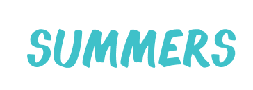

# Introduce
* Instagram 에 영감을 받아 진행중인 SNS 프로젝트 입니다.
* [vanila-instagram](https://github.com/bear-bear-bear/vanilla-instagram) 해당 팀 프로젝트를 선행하는 개발 프로젝트입니다. ( summers 는 1인 개발 )

# Constraint
* 그동안 모든 프로젝트에서 ORM 을 도입하여 사용하였으니, 백엔드에서 ORM 을 사용하지 않고, SQL 로 작성을 진행합니다. ( SQL 작성 능력 향상을 위함 )
* 개발 전, 퍼블리싱, ERD 작성, REST Api 설계를 끝마칩니다.
* React 디렉터리 구조는 [react-structure 2021](https://www.robinwieruch.de/react-folder-structure) 를 준수합니다.
* Koa 서버 디렉터리 구조는 [koa-boilerplate](https://medium.com/swlh/advanced-koa-js-boilerplate-bda90c9abe24) 를 준수합니다.
* * *
* [Figma 퍼블리싱](https://www.figma.com/file/45zVowWG6RrFv4x2VL7YK8/Summers?node-id=0%3A1)
* [ERDCloud ERD](https://www.erdcloud.com/d/c7mL9Srs3JXPTN8To)

| 개발 영역 | 이름 |
| ----- | --- |
| 프런트엔드 | React.js + Typescript |
| 백엔드 | Koa.js + Typescript, MariaDB LTS |
| 기타 | Swagger API, Docker, NginX |
